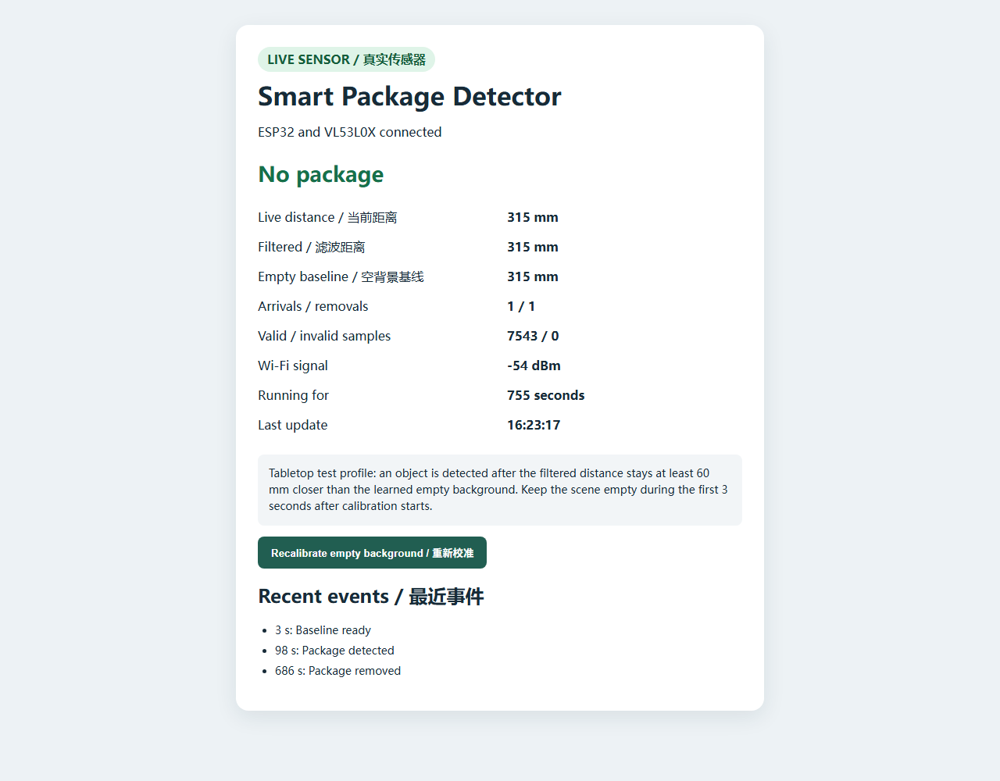
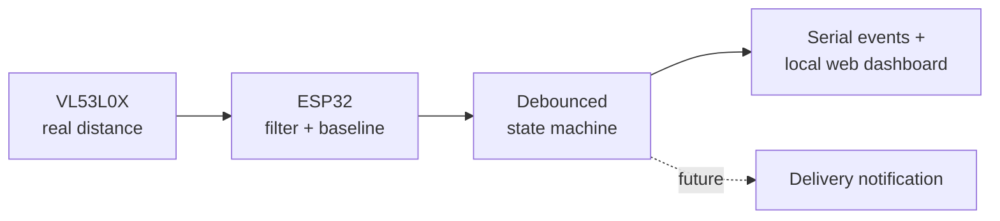

# Smart Package Detector

[](https://github.com/jonathanliyou0623-wq/smart-package-detector/actions/workflows/firmware.yml)
[](https://www.espressif.com/en/products/socs/esp32)
[](#project-status)
[](LICENSE)

An independent embedded-systems project that detects when an object is placed in front of a VL53L0X time-of-flight distance sensor. An ESP32 filters the measurements, rejects brief occlusions, and serves the live result over local Wi-Fi.

> **September 21, 2026 milestone:** The soldered VL53L0X, ESP32 detection logic, and local Wi-Fi dashboard completed a controlled tabletop arrival/removal test. With a white-paper background at about 315 mm, a tissue roll produced about 211 mm and one arrival event; removing it returned about 317 mm and produced one removal event.

## Real sensor dashboard

The current firmware reads only valid VL53L0X measurements, learns an empty-scene baseline, and exposes the detector state through a bilingual local webpage and JSON API. The page includes live and filtered distance, baseline, valid/invalid sample counts, event counters, history, recalibration, manual experiment markers, and a [CSV download of recent measurements](docs/data-logging.md).



*Actual ESP32-hosted page after the controlled tabletop test. It shows the restored 315 mm empty scene, one detected arrival, one removal, and 7,543 valid samples with no invalid samples during this run. See the [test record and limitations](docs/real-sensor-test.md).*

## Simulation running on ESP32

The board generates synthetic distance samples and serves the resulting detector
state to a browser over local Wi-Fi. The dashboard shows raw simulated distance,
filtered distance, learned baseline, event counters, and recent events. A restart
button clears the simulation and recalibrates it.

| Simulated package present | Simulated package removed |
| --- | --- |
|  |  |

*Actual browser captures of the ESP32-hosted dashboard, September 6, 2026.
Distance is synthetic; firmware execution, detection decisions, and Wi-Fi/HTTP
communication run on the physical board. These are not real delivery results.*

The live dashboard is served on the board's local network, so its private address
is not a public demo link. [Run the simulation on your own ESP32](firmware/wifi_status/README.md)
or read the [experiment and observed results](docs/simulation.md).

## Why this project?

Delivery notifications report when a carrier marks an item delivered, not whether an object is physically present at the door. This project explores a low-cost, privacy-conscious detector that can eventually send a notification without requiring an always-on camera.

## Current prototype



The detector:

- learns a baseline distance during startup;
- applies an exponential moving average to noisy readings;
- requires a sustained distance decrease before reporting a package;
- requires sustained clearance before reporting removal; and
- updates its baseline slowly only while the doorway is clear.

## Hardware used / selected

| Part | Model or type | Role | Current status |
| --- | --- | --- | --- |
| Microcontroller board | ESP32 development board (`ESP32 Dev Module` board profile) | Runs firmware and serves the local Wi-Fi dashboard | Upload, serial, Wi-Fi, and simulated detection validated |
| Distance sensor | VL53L0X ToF breakout marked `VL53LXX-V2` | Provides real distance measurements over I2C | Header soldered; communication, valid readings, and tabletop detection validated |
| Prototyping board | Mini solderless breadboard | Makes temporary connections without soldering | Available |
| Wiring | Male-male, male-female, and female-female Dupont jumper wires | Connects the ESP32, breadboard, and sensor | Available |
| Connection/power | USB data cable | Powers and programs the ESP32 | Validated |

The Arduino board profile is recorded here because it is known; the exact manufacturer/version printed on the ESP32 board and VL53L0X breakout will be added after the next physical hardware check rather than guessed. See [hardware notes](docs/hardware.md) and [the wiring guide](docs/wiring.md).

## Learning as I build

This is intentionally an iterative learning project. I first verified one layer at a time—computer-to-board upload, serial output, then hardware-independent detection logic—before adding the sensor. Keeping the detection state machine independent from Arduino lets me test ideas with simulated distance data while the physical prototype is still being assembled.

Completed work and open questions are reflected directly in the project-status checklist and engineering notes so that the public repository stays concise and honest.

## Repository layout

```text
firmware/smart_package_detector/
  smart_package_detector.ino   Arduino entry point and sensor I/O
  package_detector.h           Hardware-independent detection logic
  detector_config.h            Tunable thresholds
firmware/wifi_status/
  wifi_status.ino              Live dashboard and HTTP API on ESP32
  simulation.h                Synthetic distance input sequence
  secrets.example.h           Placeholder configuration; real secrets stay local
firmware/real_sensor_dashboard/
  real_sensor_dashboard.ino   VL53L0X input plus live Wi-Fi dashboard
  sample_log.h                Bounded measurement history and CSV formatting
  secrets.example.h           Placeholder configuration; real secrets stay local
tests/
  test_package_detector.cpp    Host-side state-machine tests
  test_desktop_profile.cpp     Regression test based on real tabletop readings
  test_sample_log.cpp          Ring-buffer and CSV-format tests
  test_simulation.cpp          Repeated cycles, confirmation delay, and reset
docs/simulation.md             Experiment, evidence, and limits
docs/real-sensor-test.md       Real measurement procedure, results, and limits
docs/data-logging.md           Measurement CSV fields and experiment workflow
docs/images/                   Actual simulation dashboard screenshots
docs/wiring.md                 Pin map and bring-up checklist
docs/hardware.md               Device descriptions and selection notes
```

## Run the host-side tests

The core detection logic has no Arduino dependency, so algorithm changes can be tested on a computer without connected hardware.

```bash
cmake -S . -B build
cmake --build build
ctest --test-dir build --output-on-failure
```

## Run the sensor-free simulation

No sensor or additional Arduino library is required beyond ESP32 board support.
Follow the [simulation setup](firmware/wifi_status/README.md), upload `wifi_status.ino`,
and open the address printed in Serial Monitor. The webpage is embedded in that
sketch; it does not need a separate computer-hosted server.

## Upload the real sensor dashboard

1. Install the ESP32 board package in Arduino IDE.
2. Install the `Adafruit VL53L0X` library from Library Manager.
3. Copy `firmware/real_sensor_dashboard/secrets.example.h` to `secrets.h` and enter local Wi-Fi credentials.
4. Open `firmware/real_sensor_dashboard/real_sensor_dashboard.ino`.
5. Select **ESP32 Dev Module** and the correct serial port.
6. Upload, then open Serial Monitor at **115200 baud** and visit the printed local address.

Observed startup output:

```text
Real VL53L0X Wi-Fi dashboard
VL53L0X online.
Open http://10.0.0.47/
```

## Project status

- [x] ESP32 toolchain, upload, and serial output validated
- [x] Hardware-independent detection state machine implemented
- [x] Automated tests for calibration, detection, removal, and brief occlusions
- [x] ESP32 Wi-Fi connection and local HTTP dashboard validated
- [x] Simulated arrival/removal sequence verified on the physical ESP32
- [x] Dashboard restart, event history, and counters verified
- [x] Obtain, solder, connect, and validate the VL53L0X sensor
- [x] Validate real arrival/removal detection in a controlled tabletop setup
- [x] Integrate real sensor measurements into the local Wi-Fi dashboard
- [x] Add bounded measurement history, experiment markers, and CSV export
- [ ] Collect labeled trials and calculate false-positive rate and detection latency
- [ ] Collect doorway data and tune thresholds
- [ ] Add Wi-Fi notifications without committing credentials
- [ ] Evaluate optional camera-based classification

## Engineering notes

The defaults in [`detector_config.h`](firmware/smart_package_detector/detector_config.h) are starting values, not measured guarantees. Real doorway geometry, sensor angle, ambient light, and package material all affect readings. Tuning will be based on logged measurements from the physical prototype.

## License

MIT License. See [LICENSE](LICENSE).
