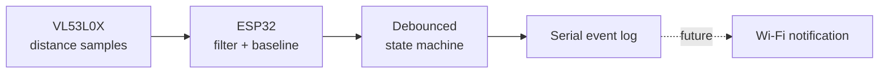

# Smart Package Detector

[](https://github.com/jonathanliyou0623-wq/smart-package-detector/actions/workflows/firmware.yml)
[](https://www.espressif.com/en/products/socs/esp32)
[](#project-status)
[](LICENSE)

An independent embedded-systems project that detects when a package is placed near an apartment or dorm door. The first prototype uses an ESP32 and a VL53L0X time-of-flight distance sensor, with a small state machine to reject brief occlusions instead of treating every distance change as a delivery.

> This repository documents an active prototype. The ESP32 development environment and serial communication have been validated; sensor integration and real-world threshold tuning are the next hardware milestones.

## Why this project?

Delivery notifications report when a carrier marks an item delivered, not whether an object is physically present at the door. This project explores a low-cost, privacy-conscious detector that can eventually send a notification without requiring an always-on camera.

## Current prototype



The detector:

- learns a baseline distance during startup;
- applies an exponential moving average to noisy readings;
- requires a sustained distance decrease before reporting a package;
- requires sustained clearance before reporting removal; and
- updates its baseline slowly only while the doorway is clear.

## Hardware

- ESP32 development board
- VL53L0X time-of-flight distance sensor
- Breadboard and jumper wires
- USB cable and a 2.4 GHz Wi-Fi network for later notification work

See [the wiring guide](docs/wiring.md) before powering the circuit.

## Repository layout

```text
firmware/smart_package_detector/
  smart_package_detector.ino   Arduino entry point and sensor I/O
  package_detector.h           Hardware-independent detection logic
  detector_config.h            Tunable thresholds
tests/
  test_package_detector.cpp    Host-side state-machine tests
docs/wiring.md                 Pin map and bring-up checklist
```

## Run the host-side tests

The core detection logic has no Arduino dependency, so it can be tested before the sensor arrives.

```bash
cmake -S . -B build
cmake --build build
ctest --test-dir build --output-on-failure
```

## Upload to an ESP32

1. Install the ESP32 board package in Arduino IDE.
2. Install the `Adafruit VL53L0X` library from Library Manager.
3. Open `firmware/smart_package_detector/smart_package_detector.ino`.
4. Select **ESP32 Dev Module** and the correct serial port.
5. Upload, then open Serial Monitor at **115200 baud**.

Expected startup output:

```text
Smart Package Detector
VL53L0X online. Calibrating...
Baseline ready: 812 mm
EVENT: package detected
```

## Project status

- [x] ESP32 toolchain, upload, and serial output validated
- [x] Hardware-independent detection state machine implemented
- [x] Automated tests for calibration, detection, removal, and brief occlusions
- [ ] Connect and validate VL53L0X measurements
- [ ] Collect doorway data and tune thresholds
- [ ] Add Wi-Fi notifications without committing credentials
- [ ] Evaluate optional camera-based classification

## Engineering notes

The defaults in [`detector_config.h`](firmware/smart_package_detector/detector_config.h) are starting values, not measured guarantees. Real doorway geometry, sensor angle, ambient light, and package material all affect readings. Tuning will be based on logged measurements from the physical prototype.

## License

MIT License. See [LICENSE](LICENSE).
