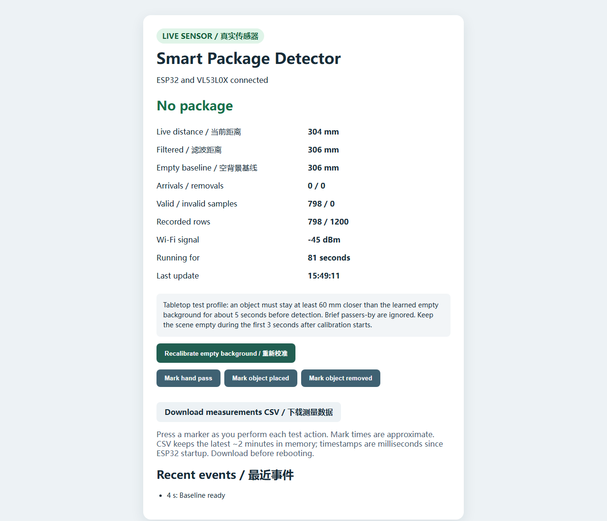

# Measurement logging and CSV export

The real sensor dashboard records each 100 ms sampling attempt in a fixed
1,200-row RAM ring buffer. It records valid returns, invalid range statuses,
library errors, and time spent with the sensor offline. Recalibration and manual
experiment markers also produce rows. The newest rows replace the oldest ones
when the buffer fills; at a 10 Hz sample rate it holds approximately two minutes.

Open the ESP32's local webpage and select **Download measurements CSV**, or request
`GET /api/samples.csv`. No computer-side server is needed. The CSV is streamed
in small chunks, so the device does not assemble the entire file in RAM.

*Live ESP32 page during an empty-scene run, with 798 valid readings recorded.*

| Column | Meaning |
| --- | --- |
| `uptime_ms` | Milliseconds since ESP32 boot, not a calendar date |
| `quality` | `valid`, `range_invalid`, `api_error`, `sensor_offline`, `calibration_reset`, or `manual_marker` |
| `api_error` | Adafruit library error code; zero when no API error occurred |
| `range_status` | VL53L0X range status; `0` is valid and `255` means no status was available |
| `raw_mm` | Sensor result in millimeters; use as distance only when `quality=valid` |
| `filtered_mm` | Detector's filtered distance at this row |
| `baseline_mm` | Learned empty-scene reference at this row |
| `state` | `calibrating`, `clear`, or `package_present` |
| `event` | `none`, `baseline_ready`, `package_detected`, or `package_removed` |
| `marker` | Manually marked `hand_pass`, `object_placed`, or `object_removed`; otherwise `none` |

For a controlled trial, keep the scene empty while calibrating. Press the relevant
marker button as you perform an action, let the detector respond, then download
the CSV before the two-minute buffer overwrites the rows. For example, compare
the `object_placed` marker's `uptime_ms` with the following `package_detected`
event for an approximate detection delay. The marker is a human click, so it is
not a precise ground-truth timestamp. Several labeled trials are needed before
reporting false-positive or detection-rate metrics.

The history is lost on reboot or power loss. CSV files are local experimental
data and are not automatically uploaded to GitHub.
