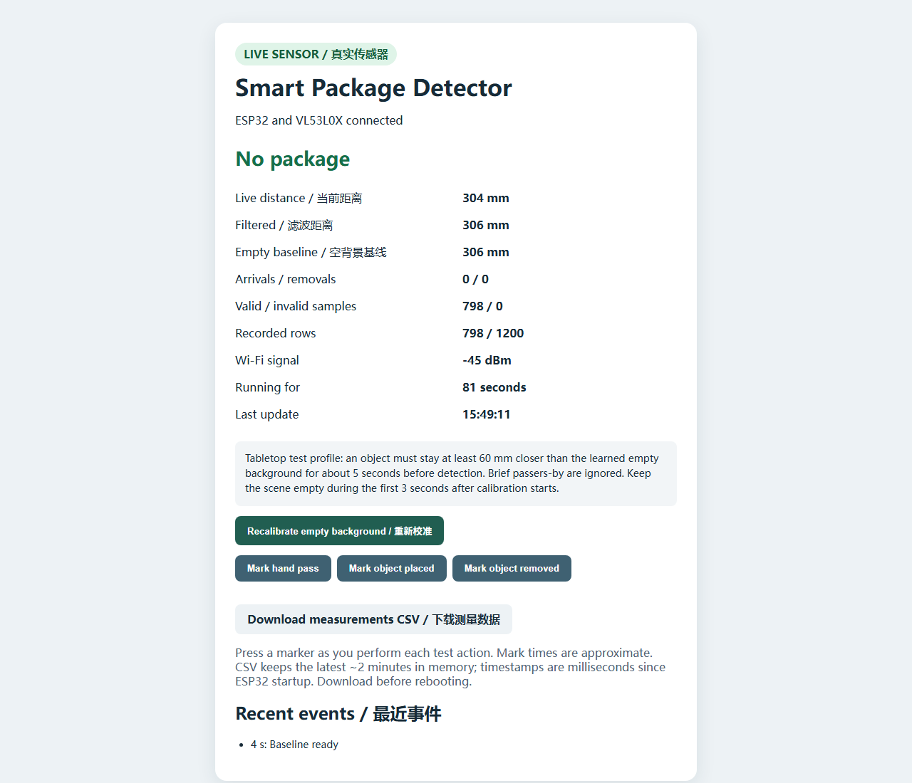

# Measurement logging and CSV export

The real sensor dashboard records each 100 ms sampling attempt in a fixed
1,200-row RAM ring buffer. It records valid returns, invalid range statuses,
library errors, and time spent with the sensor offline. Recalibration and manual
experiment markers also produce rows. The newest rows replace the oldest ones
when the buffer fills; at a 10 Hz sample rate it holds approximately two minutes.

Open the ESP32's local webpage and select **Download measurements CSV**, or request
`GET /api/samples.csv`. No computer-side server is needed. The CSV is streamed
in small chunks, so the device does not assemble the entire file in RAM.

The VL53L0X runs in a dedicated FreeRTOS task pinned to ESP32 core 1 and scheduled
every 100 ms. A mutex protects detector state and the live ring buffer. The CSV
handler holds that mutex only while copying the buffer into a fixed-size snapshot,
then releases it before any network write; new readings therefore continue without
changing rows in the active download. The snapshot adds about 28 KB of static RAM,
and the sampling task reserves a 6 KB runtime stack. FreeRTOS scheduling improves
isolation from HTTP traffic but is not a hard real-time guarantee.



*Live ESP32 page during an empty-scene run, with 798 valid readings recorded.*

| Column | Meaning |
| --- | --- |
| `uptime_ms` | Milliseconds since ESP32 boot, not a calendar date |
| `quality` | `valid`, `range_invalid`, `api_error`, `sensor_offline`, `calibration_reset`, or `manual_marker` |
| `api_error` | Adafruit library error code; zero when no API error occurred |
| `range_status` | VL53L0X range status; `0` is valid and `255` means no status was available |
| `raw_mm` | Sensor result in millimeters; use as distance only when `quality=valid` |
| `filtered_mm` | Detector's filtered distance at this row |
| `baseline_mm` | Learned empty-scene reference at this row |
| `state` | `calibrating`, `clear`, or `package_present` |
| `event` | `none`, `baseline_ready`, `package_detected`, or `package_removed` |
| `marker` | Manually marked `hand_pass`, `object_placed`, or `object_removed`; otherwise `none` |

For a controlled trial, keep the scene empty while calibrating. Press the relevant
marker button as you perform an action, let the detector respond, then download
the CSV before the two-minute buffer overwrites the rows. For example, compare
the `object_placed` marker's `uptime_ms` with the following `package_detected`
event for an approximate detection delay. The marker is a human click, so it is
not a precise ground-truth timestamp. Several labeled trials are needed before
reporting false-positive or detection-rate metrics.

The history is lost on reboot or power loss. CSV files are local experimental
data and are not automatically uploaded to GitHub.

## Save a session automatically on Windows

Run the repository's PowerShell recorder with the device's current local address:

```powershell
.\tools\capture_sensor_session.ps1 -BaseUrl http://10.0.0.47 -DurationSeconds 1800 -IntervalSeconds 10
```

The address above is the last verified address, not a permanent assignment. The
recorder requires no firmware changes. It creates a new local directory under
`build/experiments/`, downloads the complete rolling CSV at each interval, and
writes capture times, device status, failures, and observed uptime resets to
`captures.jsonl`. Stop early with Ctrl+C; completed snapshots remain on disk.

Snapshots deliberately overlap. Do not sum their row counts when analyzing a
session. Reconcile overlapping rows within each device boot before calculating
metrics; device uptime starts again after a restart. The recorded boot segment
only identifies resets observed through decreasing status uptime, so inspect
outages and timestamp discontinuities as well. A network interruption longer
than the device's retained history can still lose measurements. The recorder
logs failed requests rather than treating them as successful empty captures.

An October 7, 2026 live smoke test saved all four scheduled snapshots over 25
seconds, with 1,200 rows per snapshot. The snapshots contained 1,420 distinct
valid records within the observed boot. This verifies basic capture and local
retention; deliberate disconnection and reboot recovery remain untested.

To compare sampling with and without periodic CSV downloads, keep the sensor
scene stationary, wait until the buffer contains 1,200 rows, and run:

```powershell
.\tools\measure_capture_timing.ps1 -BaseUrl http://10.0.0.47 -PhaseSeconds 30
```

The script saves three consecutive windows: quiet, a download every 10 seconds,
and quiet again. It reports intervals between logged sensor samples and retains
the source snapshots locally. The snapshots taken to inspect quiet windows are
outside the measured windows; whole-second boundary exclusions also separate
the phases. Do not run another recorder or download CSV files during this test.
Use `-DownloadIntervalSeconds 1` for a deliberate high-load comparison that
requests one full snapshot per second; the default remains 10 seconds.
