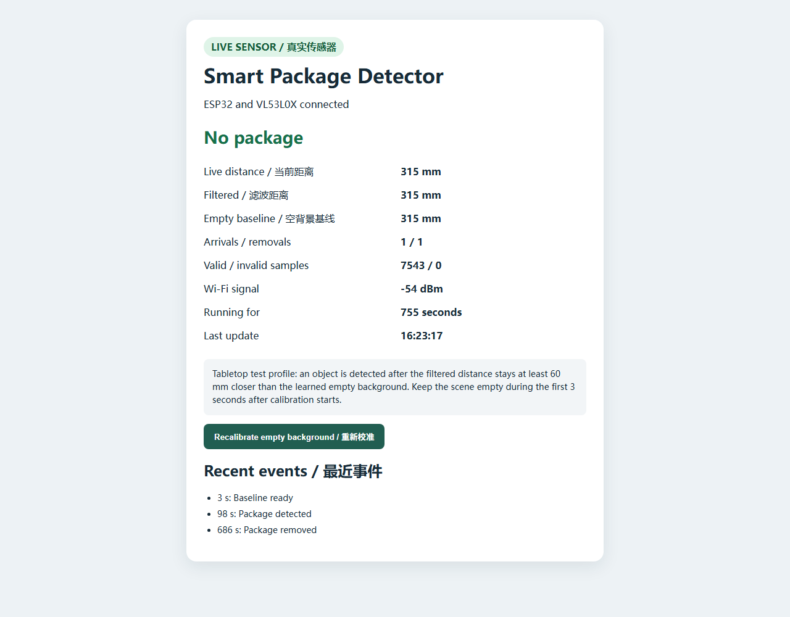

# Real VL53L0X tabletop test

This record separates what was observed on the physical prototype from what remains to be tested at a doorway.

## Setup

- ESP32 Dev Module on USB power and local Wi-Fi
- VL53L0X breakout marked `VL53LXX-V2`
- VIN to 3V3, GND to GND, SDA to GPIO21, and SCL to GPIO22
- sensor aimed at a sheet of white paper on a tabletop
- tissue roll used as the repeatable test object
- tabletop profile used for the recorded milestone: 60 mm detection delta, 30 mm clear delta, 30 valid calibration samples, and a baseline that follows only farther empty-background drift

The bare desktop repeatedly returned VL53L0X range status 2 in this arrangement. Keeping the sensor placement and adding white paper produced valid readings. This supports a surface-return explanation for this setup, but it was not a controlled optical characterization of the desk material.

## Observed results

The serial-only bring-up first demonstrated an empty background near 312 mm, the tissue roll near 205 mm with persistent `package_present` state, and a return near 314 mm with persistent `clear` state.

The integrated Wi-Fi firmware then completed another full cycle:

| Stage | Raw distance | Detector result | Event counts |
| --- | ---: | --- | --- |
| Empty scene after startup | 317 mm | No package | 0 arrivals / 0 removals |
| Tissue roll placed | 208–212 mm | Package detected | 1 arrival / 0 removals |
| Tissue roll removed | 318–319 mm | No package | 1 arrival / 1 removal |

The dashboard's captured post-test state showed a 315 mm live distance and baseline, 7,543 valid samples, zero invalid samples, and event history entries for baseline ready, package detected, and package removed.

## Validity handling

Only VL53L0X measurements with API success and `RangeStatus == 0` enter calibration, filtering, or detection. Invalid returns are counted for diagnostics and cannot move the baseline or detector state.

## Limits and next work

This validates the electronics, measurement path, state machine, and local webpage in one controlled tabletop geometry. It does not establish ruler accuracy, maximum range, performance on different package materials, ambient-light tolerance, long-term stability, or reliability at a real doorway. The 60/30 mm thresholds are an experimental tabletop profile and should be retuned after collecting doorway data.

## Five-second arrival confirmation (September 22)

Arrival confirmation was increased from 8 to 50 qualifying samples. At the
approximately 10 Hz sample rate, this calls for about five seconds of sustained
obstruction; the 12-sample removal confirmation remains about 1.2 seconds.

- A user-held hand obstruction lasting approximately 2–3 seconds did not trigger
  an arrival: the state remained `No package` and both event counters stayed at zero.
- The first tissue-roll trial did not trigger. After 709 invalid readings, the
  sensor resumed valid ranging and calibrated at 201 mm, matching the roll's
  approximately 203 mm reading. The exact moment the roll entered view was not
  timestamped. This trial does not test the arrival delay.
- The roll was removed and calibration was restarted through the API with the
  white-paper background empty. The new baseline was 312 mm, with zero invalid
  readings after the restart.
- The roll was placed again. Three API reads showed 203–207 mm, `Package detected`,
  one arrival and zero removals. The event history recorded detection at device
  uptime 355 s. After removal, three reads showed 312–316 mm, `No package`, one
  arrival and one removal; the removal event was recorded at uptime 474 s.

These checks show that this short hand obstruction was filtered and a sustained
roll placement produced one arrival/removal cycle. Placement and removal times
were not timestamped independently, so the experiment does not directly measure
the actual detection or removal latency. The sensor still cannot tell a package
from another object that stays in view for long enough.

## Timestamped labeled trial (September 23)

The dashboard's RAM ring buffer and manual marker controls were used for a first
timestamped trial set. The setup remained the same: a white-paper background and
a tissue roll as the test object. The detector baseline was 305 mm.

| Trial | Observed samples | Result |
| --- | --- | --- |
| Brief hand pass | Minimum raw distance 87 mm; 26 consecutive qualifying samples, approximately 2.6 s | Rejected; state stayed `clear` and no arrival event occurred |
| Tissue roll placed | Filtered distance first crossed the 245 mm arrival threshold at 244 mm | Detected after 50 qualifying samples and 4.907 s; event distance 225 mm |
| Tissue roll removed | Filtered distance first crossed the 275 mm clear threshold at 276 mm | Cleared after 12 qualifying samples and 1.100 s; event distance 327 mm |

The removal marker preceded the removal event by 2.499 seconds. That interval
includes the user's physical action; the 1.100-second value starts when the
filtered measurement first satisfied the clear condition. The placement marker
was overwritten before download, so the 4.907-second value likewise measures the
detector from its first qualifying sample, not from the user's click.

All 1,200 retained rows in the placement and removal downloads were valid sensor
returns, and the completed cycle produced one arrival and one removal. This is
evidence for the configured confirmation timing in one controlled cycle. It is
not enough to report precision, recall, overall accuracy, or false positives per
hour; those require repeated labeled objects, non-package obstructions, and
longer unattended runs.

### Three-cycle repeatability check

Three additional placement/removal cycles were run with the same 305 mm baseline
and tissue roll. Every placement produced one arrival transition and every
removal produced one clear transition.

| Measurement | Trials | Mean | Range | Sample standard deviation |
| --- | ---: | ---: | ---: | ---: |
| Arrival confirmation after first qualifying filtered sample | 3 | 4.941 s | 4.910–5.004 s | 0.054 s |
| Removal confirmation after first qualifying filtered sample | 3 | 1.101 s | 1.100–1.102 s | 0.001 s |

The three placement trials and three removal trials therefore completed 3/3
expected state transitions in this fixed geometry. Two removal marker rows were
not present in the downloaded CSV, but their sensor samples and removal events
were retained and support the algorithm-delay measurements. Human marker-to-event
time is excluded from the summary because it includes the time needed to move the
object into or out of the sensor beam.

This small repeated set demonstrates deterministic confirmation timing for one
object and setup. It still cannot be interpreted as a general detection accuracy
or false-positive rate.

## Box trial with computer-side capture (October 7)

After reconnecting the unchanged prototype, the empty-scene baseline was
325 mm. A box produced 230–232 mm in three status checks and one arrival event.
After removal, three checks showed 327–332 mm and one removal event. The invalid
sample counter remained at 47 throughout these checks; no new invalid readings
were observed in the monitored interval.

The computer-side recorder saved overlapping CSV snapshots every 10 seconds.
Within this boot, the arrival required 50 qualifying samples over 5.630 seconds
and removal required 12 qualifying samples over 1.871 seconds. Both times start
at the first qualifying filtered sample, not at the physical action.

The removal confirmation window contains an 870 ms gap between valid samples,
compared with the nominal 100 ms sampling interval. The following stationary
comparison investigated synchronous HTTP downloads as the source of these stalls.

### CSV download timing diagnosis and firmware fix

With the scene held empty, three consecutive 30-second windows compared quiet
sampling, CSV downloads every 10 seconds, and quiet sampling again. Each CSV
contained the full 1,200-row buffer. Before the fix, both quiet windows had a
maximum sample interval of 101 ms, but the download window reached 779 ms and
contained two intervals over 200 ms. No invalid sensor readings occurred in
these measured windows. Together with the synchronous export code, this supports
CSV downloads blocking the sampling loop as a cause of the longer intervals.

The initial mitigation serviced due sensor samples between transmitted chunks
and read an immutable copy of the ring buffer, so ongoing sampling could not
change the downloaded row sequence. Detection thresholds remained unchanged.
Four host test executables passed, including snapshot stability while the live
ring buffer wraps. Arduino compilation and COM9 upload succeeded. Static RAM
usage is 104,240 bytes (31%); flash usage is 857,613 bytes (65%).

After upload and empty-scene calibration to 330 mm, the same experiment was
repeated once the buffer was full:

| Window | Median interval | 95th percentile | Maximum | Intervals over 200 ms |
| --- | ---: | ---: | ---: | ---: |
| Quiet before | 100 ms | 100 ms | 101 ms | 0 |
| Downloads every 10 s | 100 ms | 102 ms | 188 ms | 0 |
| Quiet after | 100 ms | 100 ms | 101 ms | 0 |

All six exported snapshots contained 1,200 valid rows with strictly increasing
timestamps. No arrival or removal occurred in the empty scene. This bounded
local-network test demonstrates reduced download-induced sampling stalls, not
hard real-time scheduling: a slow individual socket write can still delay a
sample. The earlier box-cycle latency values describe the old firmware.

A subsequent box placement with the updated firmware produced one arrival and
no invalid readings. From the first qualifying filtered sample (259 mm at
368437 ms), 50 valid samples confirmed arrival at 373338 ms: 4.901 seconds,
with a maximum interval of 101 ms within that confirmation window. The preceding
filtered reading was 283 mm, above the 270 mm arrival threshold. This is one
placement trial, measured from the qualifying sample rather than the physical
action.

The matching removal produced one removal event and returned the detector to
`No package`. The filtered distance first satisfied the 300 mm clear threshold
at 303 mm and remained qualifying for all 12 configured samples. The event was
recorded 1.100 seconds later at 332 mm; the preceding filtered reading was
295 mm. The maximum interval in the confirmation window was 100 ms, and there
were no invalid readings. The complete updated-firmware cycle therefore produced
exactly one arrival and one removal with uninterrupted confirmation windows.
These timings begin at the first qualifying filtered samples, not at the user's
physical actions, and remain results from one box and one fixed geometry.

A short hand-obstruction check followed the completed cycle. Raw distance stayed
at or below the 270 mm arrival threshold for 39 samples over 3.801 seconds and
reached a minimum of 90 mm. Because filtering decays back toward the empty-scene
distance, the filtered signal remained qualifying for 41 samples over 4.001
seconds. This was below the required 50-sample confirmation count: no arrival
event occurred, the state remained `No package`, the counters stayed at one
arrival and one removal, and the invalid-reading count remained zero. This is
one negative example rather than a measured false-positive rate.

A small gum container provided a second positive object example. With the same
330 mm baseline, its stable distance was approximately 261 mm. The filtered
distance first crossed the 270 mm arrival threshold at 269 mm; 50 valid samples
then confirmed arrival in 4.901 seconds, with a maximum sample interval of
101 ms. After removal, the filtered distance first crossed the 300 mm clear
threshold at 304 mm; 12 valid samples confirmed removal in 1.101 seconds, also
with a maximum interval of 101 ms. The detector returned to `No package` at an
empty-scene distance of approximately 342 mm. Totals reached two arrivals and
two removals with zero invalid readings during this boot. Two object examples
show broader behavior than a single box, but do not establish an overall
detection rate.

### Thirty-minute empty-scene observation

An unattended empty-scene run scheduled 180 CSV captures at 10-second
intervals. The first and last successful status records span 1,790 seconds
(29 minutes 50 seconds). Of 180 scheduled captures, 179 succeeded; capture 31
timed out after five seconds, and the following capture recovered normally.
Because each successful download contains approximately two minutes of
overlapping history, the timeout did not remove the intervening retained sensor
records. No device restart was observed.

The detector stayed `No package` throughout. Arrival and removal counters
remained at two each, no `package_detected` or `package_removed` event occurred,
and both status counters and the reconstructed sample stream reported zero
invalid readings. Raw distance ranged from 328 to 347 mm and filtered distance
from 333 to 340 mm against the 330 mm baseline. This provides one 29-minute
50-second negative observation with zero false detections; it is not sufficient
to claim a general false-positive rate.

The reconstructed stream contained 17,777 unique rows. Eight adjacent-sample
intervals exceeded 200 ms, with a maximum of 1,516 ms. These intervals occurred
near CSV capture activity and are consistent with the documented cooperative
sampling limitation: the chunk-level servicing reduced typical export stalls,
but an individual network operation can still delay sampling. The delays did
not change detector state in this empty-scene run, though they could extend
sample-count-based confirmation latency.

### Independent sampling task under sustained HTTP load

The rare 1,516 ms interval in the longer observation motivated a second
architecture change. VL53L0X acquisition now runs every 100 ms in a dedicated
FreeRTOS task pinned to ESP32 core 1 at a higher priority than the Arduino web
loop. A mutex protects detector state and the live sample log. Status requests
copy a small value snapshot while holding the mutex, and CSV export copies the
fixed 1,200-row buffer before releasing the mutex and beginning network output.
Sensor access remains confined to the sampling task. Detection thresholds and
sample confirmation counts did not change.

All four host test executables passed. The Arduino build used 858,509 bytes of
flash (65%) and 104,248 bytes of static RAM (31%), in addition to the sampling
task's 6,144-byte runtime stack. The firmware uploaded to COM9, reconnected at
the same local address, calibrated an empty baseline of approximately 335 mm,
and reported zero invalid readings.

A full-buffer A/B/A test used 45-second quiet, high-load, and quiet windows. The
high-load window requested one complete 1,200-row CSV every second. Across all
three windows, the median, 95th-percentile, and maximum sample intervals were
all 100 ms; no interval exceeded 200 ms and no invalid row occurred. All 48
saved CSV files contained 1,200 time-ordered valid rows. Individual downloads
took up to 1,703 ms, demonstrating that sensor sampling continued while the web
loop remained occupied with a slow response.

A second stress run requested a full CSV every second for three minutes. All
180 requests succeeded. Reconstructing the overlapping snapshots over 179
seconds produced 1,798 unique samples with a 100 ms median, 100 ms 95th
percentile, and 101 ms maximum interval. There were no intervals over 200 ms,
invalid readings, restarts, or detector events. This verifies isolation under
the tested local-network workload; it does not establish hard real-time behavior
under every Wi-Fi or I2C fault.

A final physical regression used the gum container after the independent task
was installed. With a 335 mm baseline, the filtered distance first qualified for
arrival at 274 mm; 50 valid samples confirmed arrival in 4.900 seconds, with a
100 ms maximum interval. After removal, 12 valid samples confirmed clearance in
1.100 seconds, also with a 100 ms maximum interval. The device returned to
`No package` at approximately 339 mm with one arrival, one removal, and zero
invalid readings since reboot. This confirms that the concurrency change
preserved the end-to-end detector behavior in one controlled object cycle.

### MQTT retry isolation and baseline correction (October 8)

MQTT/TLS work was moved from the Arduino web loop to a dedicated FreeRTOS task
on core 0. Before the broker outage, 30 status requests all succeeded with a
103.8 ms average, 137.9 ms 95th-percentile, and 241.5 ms maximum response time.
With EMQX deliberately stopped, all 60 additional requests succeeded while the
device repeatedly attempted to reconnect: average response time was 111.7 ms,
the 95th percentile was 186.7 ms, and the maximum was 269.3 ms. Restarting EMQX
restored the MQTT connection without rebooting the ESP32.

The final object check exposed a geometry issue rather than a sensor failure.
The empty scene had moved from the stored 310 mm baseline to approximately
344 mm, while the upright gum container measured about 285 mm. Recalibrating the
empty scene produced one package arrival and one removal; MQTT publish count
advanced from four to six and the detector totals reached three arrivals and
three removals. The observation motivated a safer background update rule:
while clear, the baseline may follow a farther return, which cannot be caused by
a package entering view, but it never moves toward a closer return. Host tests
cover both directions, all five test executables pass, and the updated firmware
compiled at 77% flash and 32% static RAM before successful COM9 upload. A
post-upload gum-container regression then produced one arrival at 285 mm and one
removal at 343 mm. The baseline remained 347 mm, both MQTT events published,
the pending queue stayed at zero, and the device finished in `No package`.
