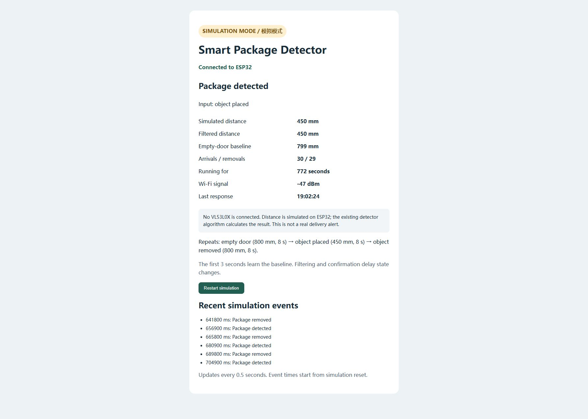
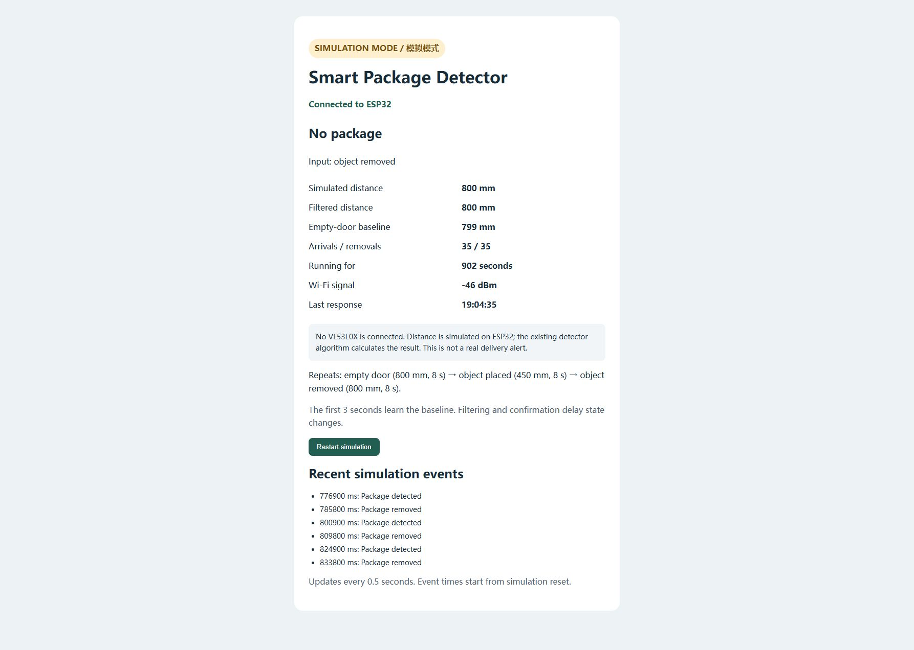

# Simulation milestone — September 6, 2026

The detection pipeline now runs on a physical ESP32 and can be inspected through
a browser on the same local network. The distance source is synthetic. No
VL53L0X is connected, and no real package measurements have been collected.

## Experiment

The firmware supplies one distance sample approximately every 100 ms. Each cycle
contains 80 samples at 800 mm (empty doorway), 80 at 450 mm (object placed), and
80 back at 800 mm (object removed). It repeats automatically. The first 30 valid
samples calibrate the background distance.

The existing `PackageDetector` performs filtering, baseline tracking, hysteresis,
and consecutive-sample confirmation. The simulation changes its input; it does
not directly set the detector state. See the [source and setup instructions](../firmware/wifi_status/README.md).

## Observed results

After restarting the simulation, both serial output and the dashboard recorded:

| Sample time | Event | Meaning |
| --- | --- | --- |
| 3,000 ms | Baseline ready | Initial empty-door calibration completed |
| 8,900 ms | Package detected | Sustained 450 mm input confirmed after filtering |
| 17,800 ms | Package removed | Sustained 800 mm input confirmed after clearance |

Times are sample count multiplied by the nominal 100 ms interval; actual wall
time can be longer due to scheduling. They are observations for these synthetic
inputs, not measured performance guarantees for a doorway sensor.

The restart button cleared counters from 2 / 2 to 0 / 0, recalibrated, and then
produced 1 / 0 followed by 1 / 1. The page updates every half second.

### Simulated arrival

### After simulated removal

Screenshots were captured from the live board after multiple repeated cycles.
Counters reflect the capture moment. The simulation badge and sensor disclaimer
are deliberately visible in both images.

## Validation and next hardware step

- Compiled and uploaded the simulation sketch through Arduino IDE.
- Verified calibration, arrival, removal, counter reset, and local webpage updates
  on the physical ESP32.
- Host-side tests cover three simulated cycles, confirmation delays, event
  counters, and reset, alongside the original detector tests.
- CI runs the host tests and compiles both sketches; its Wi-Fi configuration uses
  placeholders, so no credentials are required in the repository.

Next: obtain the VL53L0X, verify the actual breakout pin labels, follow the
[wiring checklist](wiring.md), and collect real distance readings before tuning
thresholds. Real sensor behavior, notification delivery, and network outage
recovery remain unverified.
